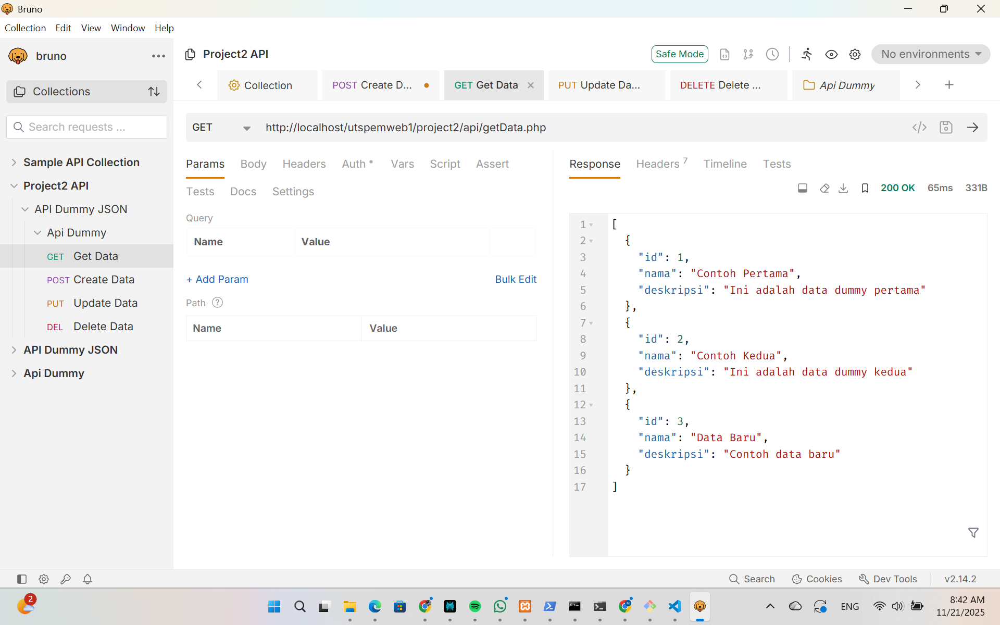

📌 README Project 2 – API Dummy JSON (CRUD dengan PHP & Bruno)
📁 Struktur Project
project2/
 ├── api/
 │   ├── dummy.json
 │   ├── getData.php
 │   ├── createData.php
 │   ├── updateData.php
 │   ├── deleteData.php
 │   └── index.php
 ├── getData.png
 ├── Get data Update.png
 ├── Create Data.png
 ├── Delete Data.png
 ├── File Explorer & XAMPP.png
 └── README

Tujuan Project

Project ini membuat REST API sederhana menggunakan PHP + file JSON sebagai database.
API dapat melakukan operasi CRUD:
- GET → Ambil semua data
- POST → Tambah data baru
- PUT → Update data berdasarkan ID
- DELETE → Hapus data berdasarkan ID
Semua API di-test menggunakan Bruno API Client.

🚀 API Endpoints
| Method | Endpoint              | Fungsi                 |
| ------ | --------------------- | ---------------------- |
| GET    | `/api/getData.php`    | Mengambil seluruh data |
| POST   | `/api/createData.php` | Menambahkan data       |
| PUT    | `/api/updateData.php` | Mengubah data          |
| DELETE | `/api/deleteData.php` | Menghapus data         |

🌻Screenshot Pengujian (Bruno)
File Explorer & XAMPP

GET Data

GET Data Update

Create Data

Delete Data

📌 Cara Menjalankan

1. Pindahkan folder project2 ke:
C:\xampp\htdocs\utspemweb1\project2\
2. Jalankan Apache di XAMPP
3. Test API menggunakan Bruno dengan URL:
http://localhost/utspemweb1/project2/api/<nama_file>.php

Status
🟢 Selesai dan semua endpoint berjalan dengan baik.
